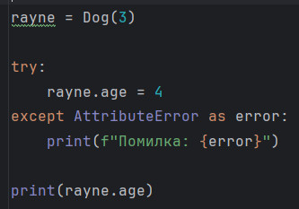
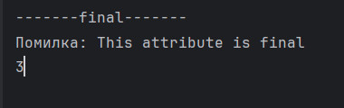

# Огляд Основних Концепцій Роботи з Класами в Python

## Зміст

1. **Конструктор та Ініціалізація**
   - Конструктор класу використовує метод `__init__` для ініціалізації нових екземплярів класу.
     ```python
     class Dog:
         def __init__(self, name, age):
             self.name = name
             self.age = age
     ```
   - Цей метод автоматично викликається при створенні нового об'єкта.

2. **Метод `__str__`**
   - Метод `__str__` використовується для визначення строкового представлення об'єкта, корисного для друку та логування.
     ```python
     class Dog:
         def __str__(self):
             return f"Dog: {self.name}, Age: {self.age}"
     ```
   - Цей метод може бути корисним для створення читабельного представлення об'єктів.

3. **Сетери та Гетери**
   - Встановлення за допомогою декораторів `@property` та `@атрибут.setter`.
     ```python
     class Dog:
         @property
         def age(self):
             return self._age

         @age.setter
         def age(self, value):
             if value < 0:
                 raise ValueError("Вік не може бути від'ємним")
             self._age = value
     ```

4. **Захищені атрибути**
   - `__` перед ім'ям атрибута ініціює механізм name mangling.
     ```python
     self.__name = 'Rex'
     ```

5. **Одинарне підкреслення**
   - `_` перед ім'ям атрибута вказує на внутрішнє використання.
     ```python
     self._internal_use = 'internal'
     ```

6. **Імпорт класів з однаковим ім'ям**
   - Використання `as` для розрізнення класів з однаковим ім'ям.
     ```python
     from module1 import Dog as Dog1
     from module2 import Dog as Dog2
     ```

7. **FinalAttribute**
   - Дескриптори для створення незмінних атрибутів.
     ```python
     class FinalAttribute:
         def __set__(self, instance, value):
             if self._value_set:
                 raise AttributeError("This attribute is final")
     ```



## Додаткові Концепції

- **Наслідування**
  - Підтримка наслідування дозволяє створювати підкласи, що наслідують атрибути та методи батьківського класу.
    ```python
    class Poodle(Dog):
        def bark(self):
            return "Woof!"
    ```

- **Магічні методи**
  - Python підтримує різноманітні "магічні" методи, такі як `__add__`, `__eq__`, які дозволяють кастомізувати поведінку класів.
    ```python
    class Vector:
        def __init__(self, x, y):
            self.x = x
            self.y = y

        def __add__(self, other):
            return Vector(self.x + other.x, self.y + other.y)
    ```