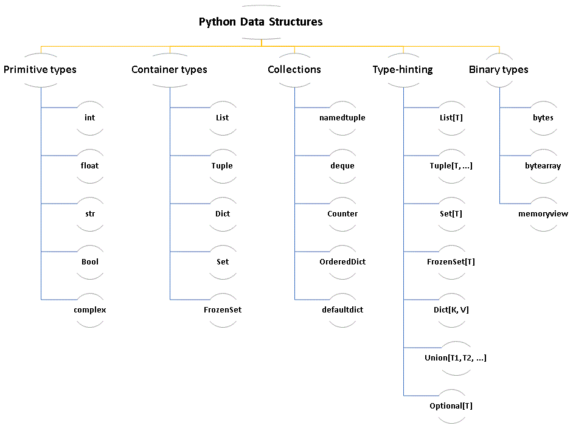

# Python Data Structures

## Primitive types

Basic data types such as numbers, strings, and booleans.

- `int`: [Documentation](https://docs.python.org/3/library/stdtypes.html#numeric-types-int-float-complex)
- `float`: [Documentation](https://docs.python.org/3/library/stdtypes.html#numeric-types-int-float-complex)
- `str`: [Documentation](https://docs.python.org/3/library/stdtypes.html#text-sequence-type-str)
- `bool`: [Documentation](https://docs.python.org/3/library/stdtypes.html#boolean-values)
- `complex`: [Documentation](https://docs.python.org/3/library/stdtypes.html#numeric-types-int-float-complex)

## Container types

Data structures that can store and organize collections of data.

- `List`: [Documentation](https://docs.python.org/3/library/stdtypes.html#list)
- `Tuple`: [Documentation](https://docs.python.org/3/library/stdtypes.html#tuple)
- `Dict`: [Documentation](https://docs.python.org/3/library/stdtypes.html#dict)
- `Set`: [Documentation](https://docs.python.org/3/library/stdtypes.html#set)
- `FrozenSet`: [Documentation](https://docs.python.org/3/library/stdtypes.html#frozenset)

## Collections

Specialized container types from the collections module.

- `namedtuple`: [Documentation](https://docs.python.org/3/library/collections.html#collections.namedtuple)
- `deque`: [Documentation](https://docs.python.org/3/library/collections.html#collections.deque)
- `Counter`: [Documentation](https://docs.python.org/3/library/collections.html#collections.Counter)
- `OrderedDict`: [Documentation](https://docs.python.org/3/library/collections.html#collections.OrderedDict)
- `defaultdict`: [Documentation](https://docs.python.org/3/library/collections.html#collections.defaultdict)

## Type-hinting

Type annotations for specifying the expected data types.

- `List[T]`: [Documentation](https://docs.python.org/3/library/typing.html#typing.List)
- `Tuple[T, ...]`: [Documentation](https://docs.python.org/3/library/typing.html#typing.Tuple)
- `Set[T]`: [Documentation](https://docs.python.org/3/library/typing.html#typing.Set)
- `FrozenSet[T]`: [Documentation](https://docs.python.org/3/library/typing.html#typing.FrozenSet)
- `Dict[K, V]`: [Documentation](https://docs.python.org/3/library/typing.html#typing.Dict)
- `Union[T1, T2, ...]`: [Documentation](https://docs.python.org/3/library/typing.html#typing.Union)
- `Optional[T]`: [Documentation](https://docs.python.org/3/library/typing.html#typing.Optional)

## Binary types

Types used for working with binary data.

- `bytes`: [Documentation](https://docs.python.org/3/library/stdtypes.html#bytes)
- `bytearray`: [Documentation](https://docs.python.org/3/library/stdtypes.html#bytearray)
- `memoryview`: [Documentation](https://docs.python.org/3/library/stdtypes.html#memoryview)
